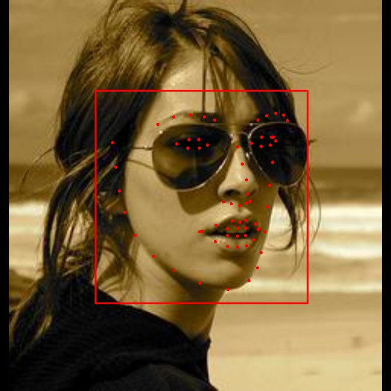
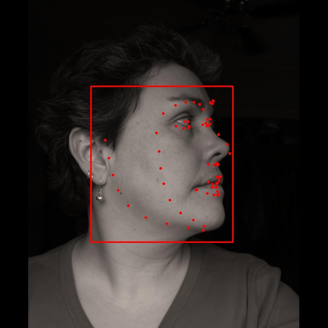
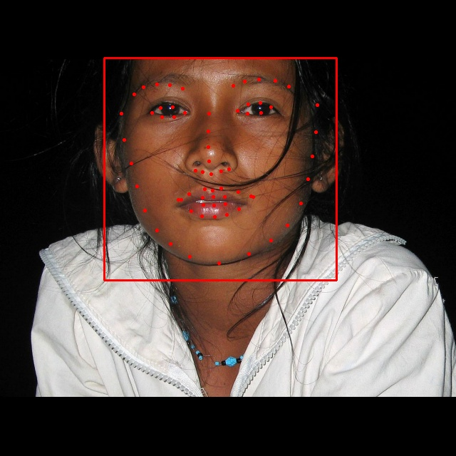

# Retinaface-Pytorch-version
### Still in process 
Thanks to Alvin Yang (https://github.com/supernotman/RetinaFace_Pytorch)

This is the branch for 68 landmarks detection, the pre-trained model is in ./out ( not the best version)

Working on 96 landmarks detection( refer to the other branch)

Based on RetinaFace 
### current model 
mobileNet V1+FPN+context module+ regressor  1.6MB
CPU～10FPS GPU 50FPU

### Train：（ Please refer to dataloader.py to change the file location）
python3 train.py -train
This model use LS3D-W dataset，or change your dataset to the format of demo.pt/ demo.jpg（68*2 tensor）

### Use local camera ：
python3 video_detect.py （ need to delete all 'cuda()', and run locally with a CPU）

### Eval Model：
python3 train.py -train False

## Todo: 
- [ ] Use SBR and BFLD to improve performance

If you have train a model with this code, welcome to discuss with me at elvishelvis6@gmail.com